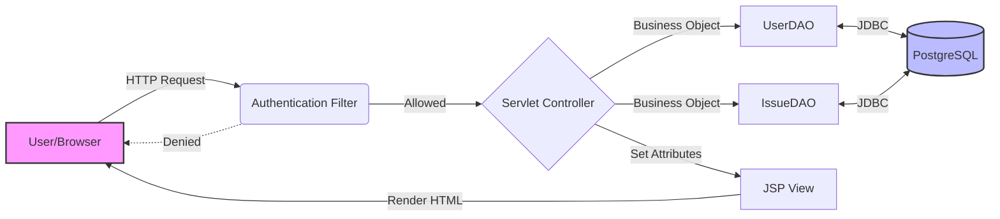
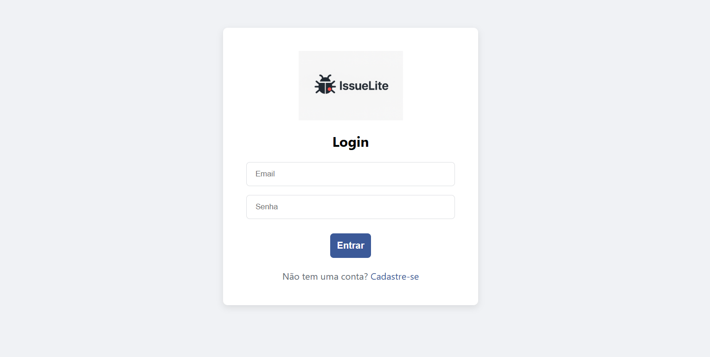
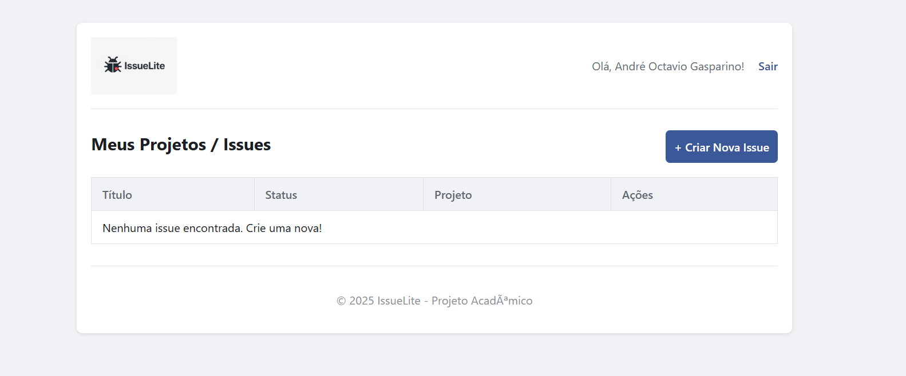
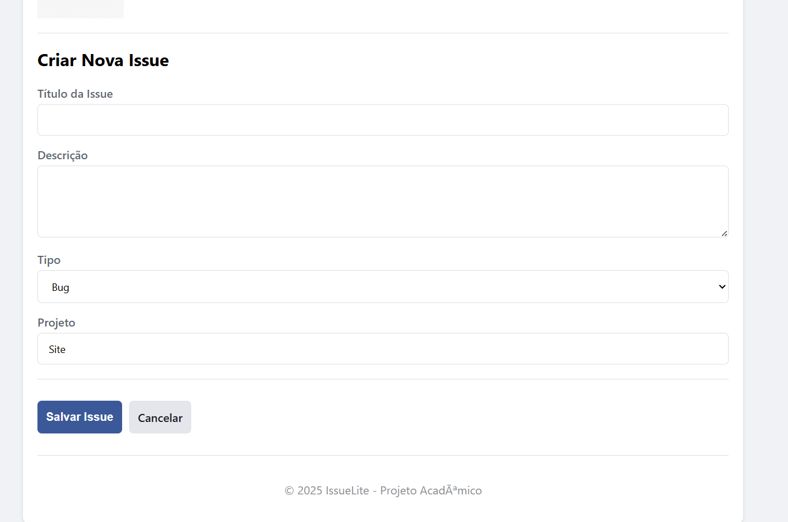

# 🐜 IssueLite - Minimalist Issue Management System

An academic project for a lightweight Issue Tracker, engineered with **Java Web** (Servlets, JSP, and pure JDBC) targeting the **Jakarta EE 9+** platform (Apache Tomcat 10.1).

## 1. 🎯 Project Objectives

* **HTTP Cycle Mastery:** Demonstrate deep understanding of the Request/Response cycle using raw Servlets (`jakarta.servlet`).
* **Architecture:** Implement a strict **MVC (Model-View-Controller)** pattern without relying on heavy frameworks.
* **Frontend:** Utilize **JSP** with **JSTL** (Jakarta Standard Tag Library) for clean view rendering, avoiding scriptlets.
* **State Management:** Manage user sessions securely using `HttpSession` and route protection via `Filters`.
* **Persistence:** Implement a full **CRUD** operation using **pure JDBC** and **PostgreSQL** for total SQL control.
* **Security:** Implement basic password security using **jBCrypt** hashing.

### 🏗️ MVC Architecture Flow



## 2. 🛠️ Tech Stack

* **Language:** Java 11+
* **Platform:** Jakarta EE 9 (Servlet 5.0, JSP 3.0)
* **Application Server:** Apache Tomcat 10.1.x
* **Database:** PostgreSQL 14+
* **Persistence:** JDBC (Native Driver)
* **Build Tool:** Apache Maven
* **Security:** jBCrypt (Password Hashing)
* **Frontend:** JSP, JSTL (Jakarta), HTML5/CSS3

## 3. ⚙️ Installation & Execution (Manual Deployment)

This project is optimized for **manual deployment** to ensure artifact integrity and overcome IDE caching issues with Jakarta EE.

### 3.1. Prerequisites

1.  **JDK 11** or higher.
2.  **Apache Maven 3.6+**.
3.  **Apache Tomcat 10.1.x** (Must support Jakarta EE 9).
4.  **PostgreSQL** (Running instance).

### 3.2. Database Setup

1.  Create the database in PostgreSQL:
    ```sql
    CREATE DATABASE issuelite_db;
    ```
2.  Execute the full DDL script located at `database/schema.sql` inside the `issuelite_db` database. This will create all tables, enums, and the initial admin user.

### 3.3. Database Configuration

1.  **CRITICAL:** Before building, open `src/main/java/br/com/issuelite/util/ConnectionFactory.java`.
2.  Update the `USER` and `PASSWORD` constants to match your local PostgreSQL credentials.

### 3.4. Build and Deploy

1.  Open a terminal (PowerShell/Bash) in the project root.
2.  Compile and package the WAR file:
    ```bash
    mvn clean package
    ```
3.  **Stop** your Tomcat server if it is currently running.
4.  Navigate to your Tomcat's `webapps/` directory (e.g., `C:\Program Files\Apache Software Foundation\Tomcat 10.1\webapps\`).
5.  **Delete** any existing `issuelite.war` file or `issuelite` folder to ensure a clean deploy.
6.  **Copy** the generated file `target/issuelite.war` from the project folder into the Tomcat `webapps/` folder.
7.  Start Tomcat by executing `bin/startup.bat` (Windows) or `bin/startup.sh` (Linux/Mac).
8.  Access the application at: `http://localhost:8080/issuelite/`

## 4. 👤 Default Test User (Admin)

The database schema includes a pre-configured admin user:

* **Email:** `admin@issuelite.com`
* **Password:** `admin123`

---
*Developed by André Octavio Gasparino as part of the Web Standards academic module.*

## 📸 Screenshots

| Login Screen | Dashboard |
|:---:|:---:|
|  |  |
| **Create Issue** |
|  | 
